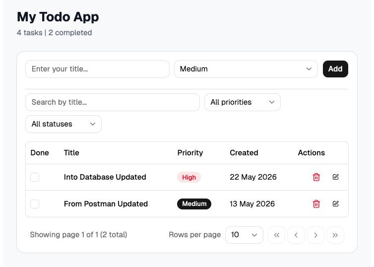
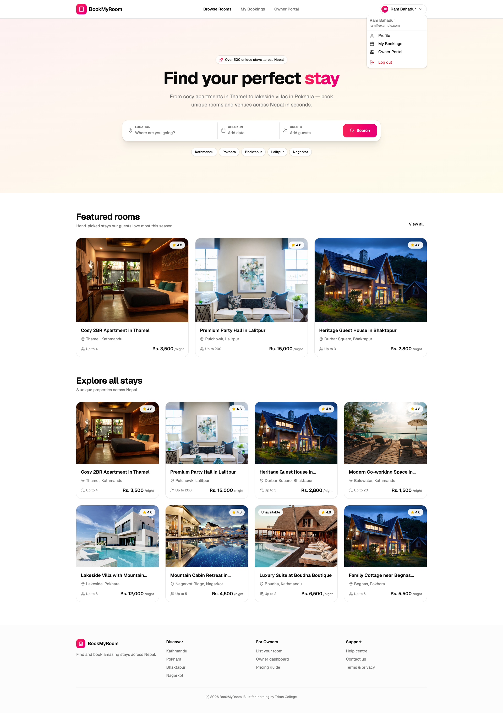
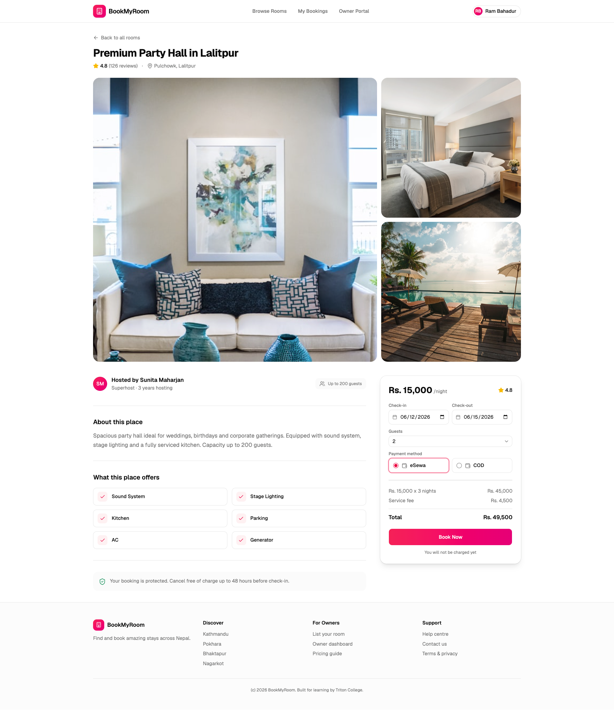
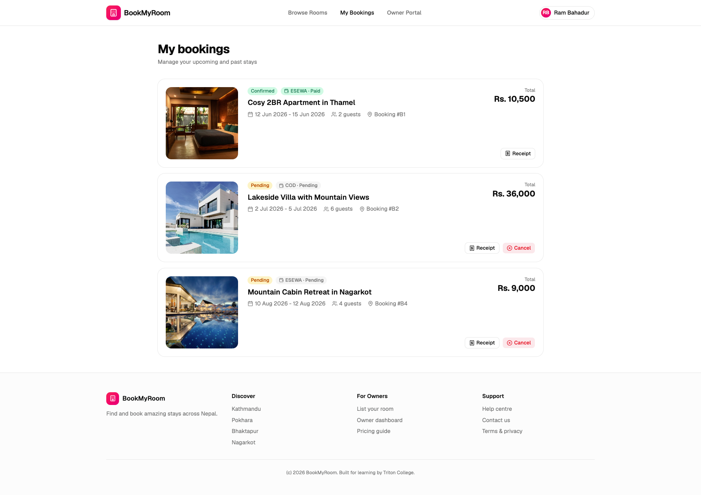
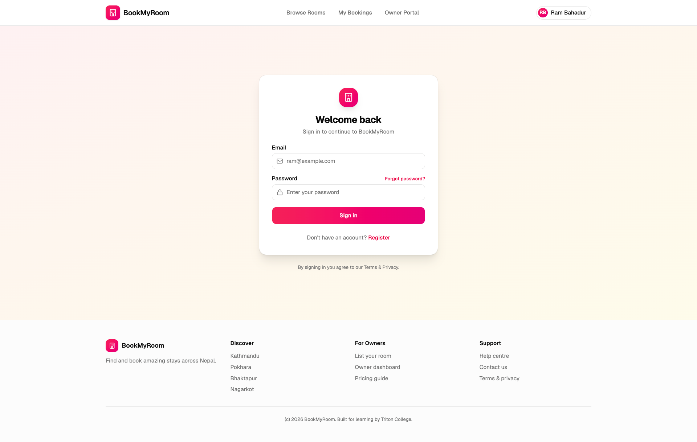
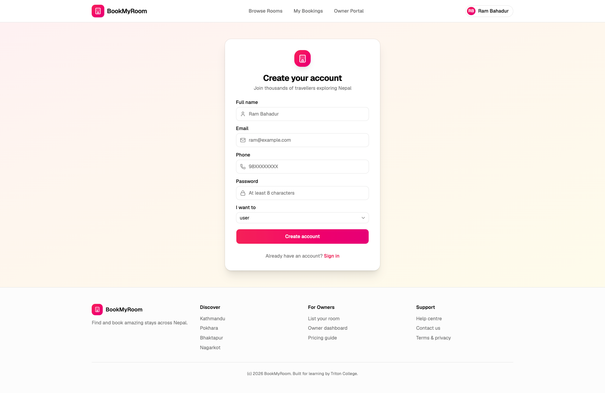
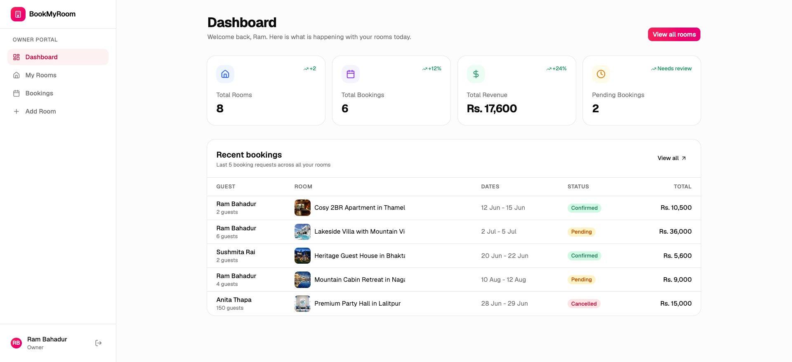
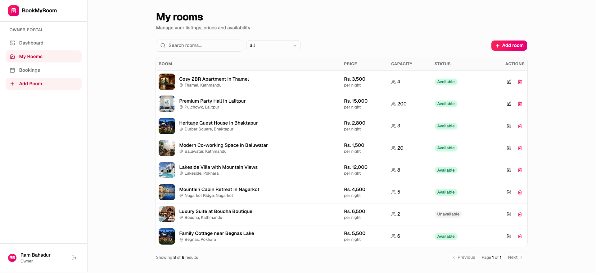
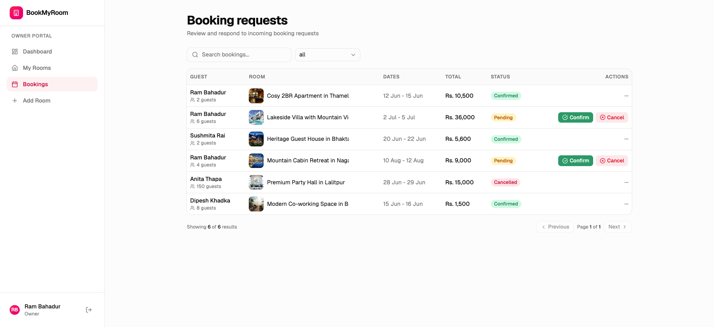

# Full-Stack / MERN Stack Web Development Course

A comprehensive MERN Stack (MongoDB, Express, React, Node.js) teaching course with **30 lessons** covering everything from React fundamentals to deploying a production-ready booking application, plus a bonus developer portfolio build.

## Instructor

**Er. Prabin Karki**
Bachelor in Computer Science and Engineering
[prabin-karki.com.np](https://prabin-karki.com.np) | prabinkarki643@gmail.com

## What Students Build

Every project in this repository is the finished reference version of what you build during the lessons. Use them to compare your own work against, or to see how a feature was wired up when you get stuck.

### 1. Todo App — `todo-mern/` (Lessons 04-17.1)
A complete full-stack Todo application to learn React fundamentals and backend basics.



### 2. BookMyRoom — `bookmyroom_app/` (Lessons 18-28)
A room/venue booking platform with:
- Owner portal (create/manage room listings with images)
- User portal (browse, search, filter, and book rooms)
- JWT authentication with role-based access, plus OTP email verification
- File uploads (room images, profile avatars)
- Payment integration (eSewa + Cash on Delivery)
- Dashboard with booking stats and revenue

#### User Portal

| | |
|---|---|
| **Home Page** — Browse all rooms with search and filters | **Home Page (logged in)** — User dropdown with profile, bookings, owner portal, logout |
|  |  |
| **Room Details** — Image gallery, amenities, booking sidebar with eSewa/COD | **My Bookings** — Track your bookings with status badges |
|  |  |
| **Login** — JWT authentication | **Register** — Choose Guest or Owner role |
|  |  |

#### Owner Portal

| | |
|---|---|
| **Owner Dashboard** — Stats cards + recent bookings | **My Rooms** — DataTable with search, filter, edit, delete |
|  |  |
| **Booking Requests** — Confirm or cancel guest bookings | |
|  | |

### 3. Developer Portfolio — `developer-portfolio/` (Lesson 30)
A single-page personal portfolio built with React, Tailwind CSS and shadcn/ui — hero, projects, skills and a validated contact form. Frontend only, no backend or database.

## Tech Stack

| Layer | Technologies |
|-------|-------------|
| **Frontend** | React, TypeScript, Vite, Tailwind CSS, shadcn/ui, React Hook Form, Zod, React Query, React Router, Axios |
| **Backend** | Node.js, Express.js, TypeScript, Mongoose, Multer, JWT, bcrypt, Nodemailer |
| **Database** | MongoDB (Atlas) |
| **Payment** | eSewa (Nepali gateway) + COD |
| **Deployment** | Vercel (frontend) + Render (backend) |

## Course Structure

| Phase | Lessons | Topic | Weeks |
|-------|---------|-------|-------|
| Prerequisites | 01-03 | HTML, CSS, JavaScript (optional) | 1 |
| Phase 1 | 04-13 | React Fundamentals + Todo App | 4 |
| Phase 2 | 14-17.1 | Express + MongoDB + API Integration | 2 |
| Phase 3 | 18-27 | BookMyRoom Full-Stack Build | 4 |
| Phase 4 | 28 | Deployment | 1 day |
| Bonus | 29-30 | Extra topics + Developer Portfolio | 1 |
| **Total** | **30 lessons** | | **~12 weeks** |

**Schedule**: 3 classes per week, 1 hour per class

## Repository Structure

```
react-node-course/
├── README.md                  # This file
├── REACT-NODE-SUMMARY.MD      # Course overview (shareable with students)
├── REACT-NODE-Course.MD       # Detailed instructor teaching guide
├── SUMMARY.md                 # Step-by-step curriculum checklist
├── CLAUDE.md                  # Project configuration
├── PROJECT_TITLE_IDEAS.md     # Final year project title ideas + viva prep
├── assets/                    # Screenshots used in this README
├── lessons/                   # Individual lesson files (01-30)
├── project-lessons/           # Final year project lessons (Next.js track)
├── todo-mern/                 # Reference build: Todo app
│   ├── todo-frontend/         # Vite + React + TypeScript
│   └── todo-backend/          # Express + Mongoose
├── bookmyroom_app/            # Reference build: BookMyRoom
│   ├── booking-frontend/      # Vite + React + TypeScript
│   └── booking-backend/       # Express + Mongoose + Multer + JWT
└── developer-portfolio/       # Reference build: portfolio (frontend only)
```

---

## ⚠️ Before You Change Any Code — Read This

The `todo-mern/`, `bookmyroom_app/` and `developer-portfolio/` folders are **reference builds**. They are the "answer key" for the lessons.

**Do not edit them directly.** If you experiment inside these folders and break something, you lose the working version you were meant to compare against.

Instead, **copy the folder somewhere else and work on your copy**:

```bash
# Example: copy BookMyRoom to your own projects folder and work there
cp -R bookmyroom_app ~/Desktop/my-bookmyroom
cd ~/Desktop/my-bookmyroom
```

```bash
# Example: copy the portfolio
cp -R developer-portfolio ~/Desktop/my-portfolio
cd ~/Desktop/my-portfolio
```

Then delete the copied `node_modules` folders (if any) and run `npm install` fresh inside your copy. Ideally, create your own git repository in the copy so your work has its own history:

```bash
rm -rf node_modules
npm install
git init
```

Keep this course repository clean so you can always `git pull` the latest lessons without conflicts.

---

## Running the Projects Locally

### Prerequisites (install once)

| Requirement | Notes |
|-------------|-------|
| **Node.js 20.19+** (22 LTS recommended) | Check with `node -v`. Download from [nodejs.org](https://nodejs.org) |
| **npm 10+** | Comes with Node. Check with `npm -v` |
| **MongoDB** | Either a free [MongoDB Atlas](https://www.mongodb.com/atlas) cluster (recommended) or a local `mongod` install. Not needed for the portfolio |
| **Git** | Check with `git --version` |
| **VS Code** | Or any editor you prefer |

### About `.env` files

Every backend and frontend that needs configuration ships with a `.env.example` file. That file is committed to git and contains **placeholder** values. The real `.env` file is **gitignored** and never committed — you create it yourself:

```bash
cp .env.example .env
```

Then open `.env` in your editor and replace the placeholder values with your own (your MongoDB connection string, your JWT secret, your Mailtrap credentials, and so on). The app will not start correctly until you do this.

> **Never commit a `.env` file.** It contains secrets. `.gitignore` already blocks it — keep it that way.

---

### 1. BookMyRoom (`bookmyroom_app/`)

BookMyRoom is two applications: an Express API and a React frontend. **Start the backend first**, because the frontend calls it.

#### Step 1 — Backend (`booking-backend`)

```bash
cd bookmyroom_app/booking-backend
npm install
cp .env.example .env
```

Now open `.env` and fill in the values:

| Variable | What to put in it |
|----------|-------------------|
| `PORT` | `4001` — leave as-is unless the port is taken |
| `MONGODB_URI` | Your MongoDB Atlas connection string, or `mongodb://127.0.0.1:27017/bookmyroom` for a local database |
| `JWT_SECRET` | A long random string. Generate one with:<br>`node -e "console.log(require('crypto').randomBytes(48).toString('hex'))"` |
| `CLIENT_URL` | `http://localhost:3002` — must match the frontend's port, CORS depends on it |
| `SMTP_*` | Your free [Mailtrap](https://mailtrap.io) sandbox inbox credentials (used for OTP emails in Lesson 21.1) |
| `ESEWA_*` | Leave the sandbox defaults (`EPAYTEST`) for local development |
| `SERVER_BASE_URL` | `http://localhost:4001` |
| `ABANDONED_BOOKING_*` | Leave the defaults |

Start the API:

```bash
npm run dev
```

You should see `Server running on port 4001`. Leave this terminal running.

#### Step 2 — Frontend (`booking-frontend`)

Open a **second terminal**:

```bash
cd bookmyroom_app/booking-frontend
npm install
cp .env.example .env
```

Open `.env` and check the single value:

| Variable | What to put in it |
|----------|-------------------|
| `VITE_API_URL` | `http://localhost:4001/api` — must match the backend's port |

Start the frontend:

```bash
npm run dev
```

Open **http://localhost:3002** in your browser.

#### Useful commands

```bash
npm run build      # Production build (both apps)
npm run typecheck  # TypeScript check without building (frontend)
npm run lint       # ESLint (frontend)
```

#### Troubleshooting

| Problem | Fix |
|---------|-----|
| `MongooseServerSelectionError` | Wrong `MONGODB_URI`, or your IP is not whitelisted in Atlas (Network Access → Add IP) |
| CORS error in the browser console | `CLIENT_URL` in the backend `.env` does not match the URL you opened the frontend on |
| Room images do not load | The backend serves them from `/uploads` — make sure the backend is running |
| `EADDRINUSE` | Another process is on port 4001 or 3002. Change `PORT` / the Vite port, and update the matching URL in the other `.env` |

---

### 2. Developer Portfolio (`developer-portfolio/`)

Frontend only — no database, no backend, and **no `.env` file needed**.

```bash
cd developer-portfolio
npm install
npm run dev
```

Vite prints the URL it started on (usually **http://localhost:5173**). Open it in your browser.

#### Useful commands

```bash
npm run build      # Production build into dist/
npm run preview    # Preview the production build locally
npm run typecheck  # TypeScript check without building
npm run lint       # ESLint
```

To make it your own, edit the content in `src/` (your name, projects, skills and links), then deploy the `dist/` folder — or connect your copied repository to Vercel and it will build automatically.

---

### 3. Todo App (`todo-mern/`)

Same two-terminal pattern as BookMyRoom: backend first, then frontend.

#### Step 1 — Backend (`todo-backend`)

```bash
cd todo-mern/todo-backend
npm install
cp .env.example .env
```

Fill in `.env`:

| Variable | What to put in it |
|----------|-------------------|
| `MONGODB_URI` | Your MongoDB Atlas connection string, or `mongodb://127.0.0.1:27017/todo` |

```bash
npm run dev
```

Runs on **http://localhost:4000**.

#### Step 2 — Frontend (`todo-frontend`)

In a second terminal:

```bash
cd todo-mern/todo-frontend
npm install
cp .env.example .env
```

Fill in `.env`:

| Variable | What to put in it |
|----------|-------------------|
| `VITE_API_URL` | `http://localhost:4000/api` |

```bash
npm run dev
```

Open **http://localhost:3000**.

---

## Final Year Projects

After the course, students build a final year project in groups of two. These use **Next.js** for the frontend (not Vite) with the same Node.js + Express + MongoDB backend they already know, so the `bookmyroom_app/` reference build stays useful throughout.

| File | Purpose |
|------|---------|
| [PROJECT_TITLE_IDEAS.md](PROJECT_TITLE_IDEAS.md) | 24 booking-style project titles with feature ideas, viva questions, and a group allocation tracker |
| [project-lessons/01-nextjs-and-shadcn-setup.md](project-lessons/01-nextjs-and-shadcn-setup.md) | Frontend setup — Next.js + shadcn/ui |
| [project-lessons/01.2-mongodb-atlas-setup.md](project-lessons/01.2-mongodb-atlas-setup.md) | MongoDB Atlas — cluster, database user, network access, connection string |
| [project-lessons/02-backend-skeleton.md](project-lessons/02-backend-skeleton.md) | Backend setup — Express + TypeScript + Mongoose skeleton |
| [project-lessons/03-github-setup-and-teamwork.md](project-lessons/03-github-setup-and-teamwork.md) | GitHub: private repo, collaborators, daily git commands, Pull Request workflow |

---

## Getting Started

### For Instructors
1. Read [REACT-NODE-Course.MD](REACT-NODE-Course.MD) for the detailed teaching guide
2. Use [SUMMARY.md](SUMMARY.md) to track lesson progress with checklists
3. Follow lessons in order — each builds on the previous

### For Students
1. Read [REACT-NODE-SUMMARY.MD](REACT-NODE-SUMMARY.MD) for course overview and setup requirements
2. Install all required software (Node.js, MongoDB, VS Code, Git)
3. Create accounts on GitHub, MongoDB Atlas, Vercel, and Render
4. Start with Lesson 04 (or Lesson 01 if you need HTML/CSS/JS basics)
5. Build your own copy as you follow along — use the reference builds in this repository only to compare and unblock yourself
